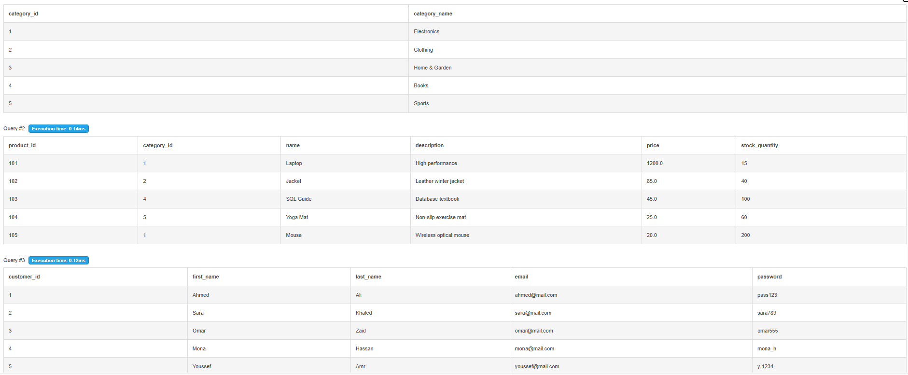
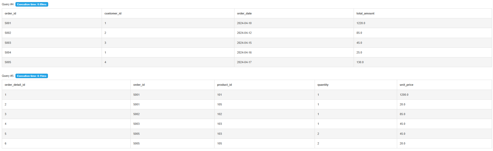
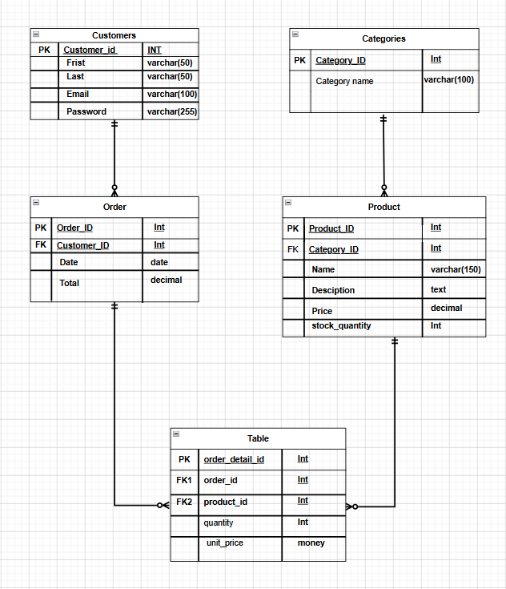
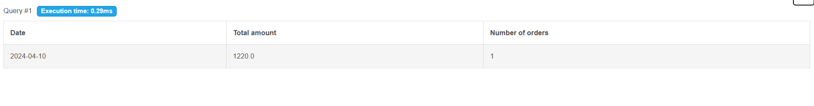
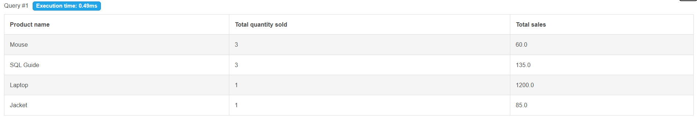
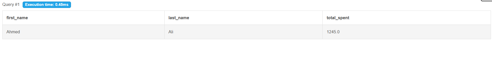

# E-commerce-DB-project# 
Database Design & SQL Analysis Project

##  Project Overview
This project demonstrates a complete database design and SQL analysis workflow for an e-commerce system.  
It covers schema design, relationships, ERD modeling, and advanced SQL queries for business reporting and analytics.

---

##  Database Schema 
In this section, we define the database structure using SQL code.

It includes:
- Table creation
- Primary and Foreign keys
- Data types and constraints

Files included:
[SQL Schema file](./schema/schema.sql).

---

##  Relationships
The system is built with the following relationships:

- **Customer & Order (1:N):** A One-to-Many relationship where one customer can place multiple orders.
- **Category & Product (1:N):** A One-to-Many relationship where each category contains multiple products.
- **Order & Order_Details (1:N):** A One-to-Many relationship where one order can contain multiple order items.
- **Product & Order_Details (1:N):** A One-to-Many relationship where each product can appear in multiple order details.

---

##  ERD (Entity Relationship Diagram)
The ERD visually represents the database structure and relationships between entities.  
It helps in understanding how tables are connected and how data flows within the system.

---

##  SQL Queries Section

### 1️⃣ Daily Revenue Report
This query generates a daily report of total revenue for a specific date.

It aggregates order data to calculate total sales per day using SUM and GROUP BY.
[Frist query file](./queries/daily_revenue.sql).

---

### 2️⃣ Monthly Top-Selling Products
This query retrieves the best-selling products within a specific month.

It helps in identifying product performance based on total quantity sold.
[Second query file](./queries/top_products_month.sql).

---

### 3️⃣ High Value Customers Report
This query retrieves customers whose total order value exceeds $500 in the past month.

It includes:
- Customer names
- Total order amount per customer
- Filtering based on aggregated spending
[Third query file](./queries/high_value_customers.sql).

---

##  Last quistion

 How we can apply a denormalization mechanism on customer and order entities

### Answer:
Denormalization can be applied by adding the customer's name directly into the Order table to eliminate frequent JOINS during data retrieval.
You can also store a total_spent field in the Customer entity to keep a pre-calculated sum of all their orders for faster reporting. This approach prioritizes read speed and performance over storage efficiency.

